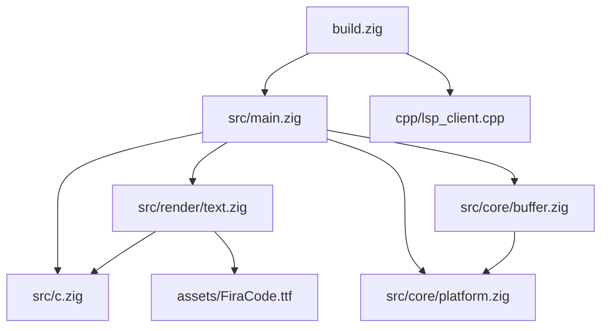

# Spectre-IDE Architecture & File Relationships

This document outlines the structure of the Spectre-IDE codebase and the relationships between its modules.

## 1. High-Level Architecture

Spectre-IDE is a hybrid application built primarily in **Zig**, utilizing **C** libraries (SDL2, FreeType) for the platform layer and **C++** for the LSP (Language Server Protocol) client.

The architecture follows a strict separation of concerns:
*   **Platform Layer (`src/main.zig`, `src/render/`)**: Handles windowing, input, and drawing.
*   **Core Logic (`src/core/`)**: Handles text manipulation, buffer management, and business logic. This layer is designed to be potentially platform-independent.
*   **Interop (`src/c.zig`, `cpp/`)**: Bridges the gap between Zig and external C/C++ libraries.

## 2. File Relationships & Dependencies

### The Entry Point
*   **`src/main.zig`**
    *   **Role**: The coordinator. It initializes the application, runs the main event loop, and orchestrates updates between the user input and the editor state.
    *   **Dependencies**:
        *   `src/c.zig`: For SDL2 functions.
        *   `src/render/text.zig`: To render text to the screen.
        *   `src/core/buffer.zig`: To maintain the state of the text editor (content, cursor, etc.).
        *   `src/core/platform.zig`: For file I/O operations.

### Core Logic Module (`src/core/`)
*   **`src/core/buffer.zig`**
    *   **Role**: The "Brain" of the text editor. Defines the `Editor`, `FileBuffer`, and `BufferManager` structs.
    *   **Relationships**:
        *   Used by `src/main.zig` to mutate text state (insert, delete, move cursor).
        *   Uses `src/core/platform.zig` to load/save files.
        *   **Independent** of the rendering layer. It doesn't know about SDL2 or pixels.
*   **`src/core/platform.zig`**
    *   **Role**: OS Abstraction layer.
    *   **Relationships**:
        *   Used by `src/core/buffer.zig` for `mmap`, `open`, `write`.
        *   Used by `src/main.zig` for spawning processes (like the external file manager).

### Rendering Module (`src/render/`)
*   **`src/render/text.zig`**
    *   **Role**: Text drawing engine.
    *   **Relationships**:
        *   Wraps **FreeType** (via `src/c.zig`) to rasterize fonts.
        *   Wraps **SDL2** (via `src/c.zig`) to cache glyphs as textures.
        *   Used by `src/main.zig` to draw the buffer content.
*   **`src/render/window.zig`** (Currently lightweight)
    *   **Role**: Window state management.

### Extension Module (`cpp/`)
*   **`cpp/lsp_client.cpp` / `.h`**
    *   **Role**: Provides C++ implementation of LSP communication.
    *   **Relationships**:
        *   Compiled and linked via `build.zig`.
        *   Exposes C-compatible functions to be called by Zig Main.

## 3. Dependency Graph

## 4. Modularization Strategy

To improve maintainability, `src/main.zig` (currently a monolithic function) should be refactored into a cohesive `App` structure:

1.  **State Encapsulation**: Move global variables into an `App` struct.
2.  **Lifecycles**: Split `main` into `App.init()`, `App.run()`, and `App.deinit()`.
3.  **Event Handling**: Isolate the SDL event switch statement into `App.handleEvent()`.
4.  **Rendering**: Isolate the drawing loop into `App.render()`.

This separation allows each component (Input, Logic, View) to be reasoned about independently.
